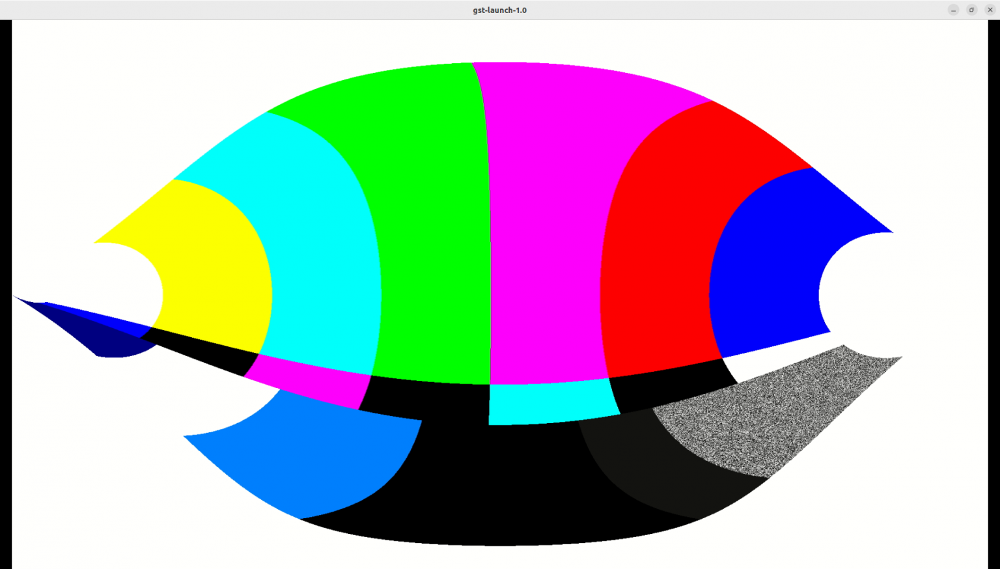
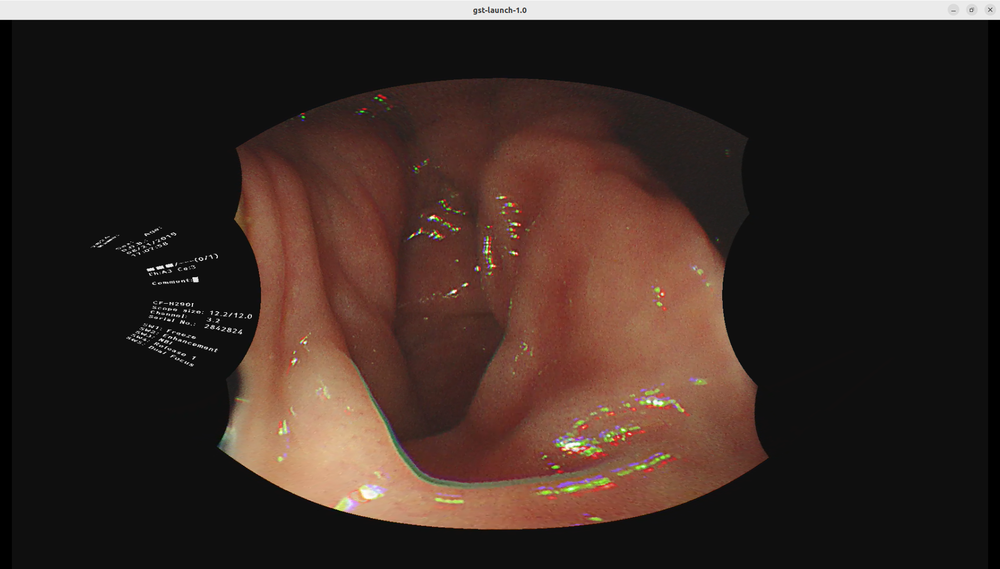

# Developing the `gst-plugins-bad-dev` Project on PC
GStreamer is a pipeline-based multimedia framework that connects various media processing systems to handle complex workflows. It is a powerful and versatile tool for creating streaming media applications, but writing new plugins can be challenging.

---

## Install OpenCV
To build the gst-plugins-bad-dev-project, install OpenCV by using the command below:
```bash
sudo apt install libopencv-dev python3-opencv
```

---

## Install Moil Dev Library
Follow the instructions on the Github repository and install it on the x86_64 platform:

https://github.com/yourskc/moildev_install

---

## Install GStreamer
Install GStreamer by using the link below:

https://gstreamer.freedesktop.org/documentation/installing/index.html?gi-language=c

To install GStreamer on Ubuntu 22.04, use the command below:
```bash
sudo apt install libgstreamer1.0-dev libgstreamer-plugins-base1.0-dev libgstreamer-plugins-bad1.0-dev gstreamer1.0-plugins-base gstreamer1.0-plugins-good gstreamer1.0-plugins-bad gstreamer1.0-plugins-ugly gstreamer1.0-libav gstreamer1.0-tools gstreamer1.0-x gstreamer1.0-alsa gstreamer1.0-gl gstreamer1.0-gtk3 gstreamer1.0-qt5 gstreamer1.0-pulseaudio
```

---

## Basic Tutorial: Hello World
Download the example hellow world script using the link below:

https://gstreamer.freedesktop.org/documentation/tutorials/basic/hello-world.html?gi-language=c

The script can be compiled by using the command below:
```bash
gcc basic-tutorial-1.c -o basic-tutorial-1 `pkg-config --cflags --libs gstreamer-1.0`
```
To test that the executable is working as expected, we will use the commands `gst-inspect-1.0` and `gst-launch-1.0` for testing.

References: 
1. https://gstreamer.freedesktop.org/documentation/tools/gst-launch.html?gi-language=c
2. https://gstreamer.freedesktop.org/documentation/tools/gst-inspect.html?gi-language=c#

:::note Install OpenCV Plugin for GStreamer

sudo apt install `gstreamer1.0-opencv`

:::

You can view the information of the source module, plugin and element by using the command below:
```bash
gst-inspect-1.0 opencv
```
```bash
gst-inspect-1.0 geometrictransform
```
```bash
gst-inspect-1.0 circle
```

---

## Launching GStreamer

To launch **GStreamer**, we can use the command `gst-launch-1.0`

Examples,

**Running test video**
```bash
gst-launch-1.0 videotestsrc ! autovideosink
```

**Running different patterns of video**
```bash
gst-launch-1.0 videotestsrc pattern=0 ! autovideosink
```

**Setting the resolution of the video**
```bash
gst-launch-1.0 videotestsrc ! video/x-raw, width=1920, height=1080 ! autovideosink
```

**Setting the filter for the video**
```bash
gst-launch-1.0 videotestsrc ! video/x-raw, width=1920, height=1080 ! videoconvert ! circle ! videoconvert ! autovideosink
```

:::note GStreamer Command

Note that the `!` in the **GStreamer** command defines different pipelines where the GStreamer will run based on it.

:::

Example Output:


---

# Project Download From Github
**Original Project**
```
https://github.com/GStreamer/gst-plugins-bad
```

**Modified Version**
```
https://github.com/GStreamer/gst-plugins-bad-dev
```
This project includes a new element named `equirectagular` filter as a part of the `gst-plugins-bad` geometric transform plugin. This elememt contains GStreamer code units, build instructions and test commands.

---

## Install Meson
Install the Meson build system by using the command below:
```bash
sudo apt-get install python3 python3-pip python3-setuptools \
python3-wheel ninja-build

pip3 install --user meson
```

---

##  Build
```bash
meson build
ninja -C build
```
After building, verify the creation of of `.so` file in:
```
<workdir>/build/gst/geometrictransform
```

Install the library locally for verification:
```
sudo cp ./build/gst/geometrictransform/libgstgeometrictransform.so /usr/lib/x86_64-linux-gnu/gstreamer-1.0
```
If encounter problem when building the project above,  the [**prebuild .iso file**](http://140.112.12.82/docu-moil-renesas/assets/files/libgstgeometrictransform-10f897e764ba4e6b4ea645ec621ee6e1.so) can be downloaded.

Next, copy the .so file to your system folder,
```bash
sudo cp libgstgeometrictransform.so /usr/lib/x86_64-linux-gnu/gstreamer-1.0
```

Check using `gst-inspect-1.0`:
```
gst-inspect-1.0 geometrictransform
```
```
gst-inspect-1.0 equirectangular 
```

Expected output:


Reference:
1. Meson: https://mesonbuild.com/Quick-guide.html

---

# Testing
:::note 

Ensure the execution directory contains `EquimatX` and `EquimatY` files.

:::

## Basic Test
```bash
cd test_env
gst-launch-1.0 videotestsrc ! video/x-raw,width=1920,height=1080 ! videoconvert ! equirectangular ! videoconvert ! autovideosink
```


## MP4 Test
```bash
cd test_env
gst-launch-1.0 playbin uri=file:///home/skc/gst-work/gst-plugins-bad-dev/test_env/endo01.mp4 video-sink="videoconvert ! equirectangular ! videoconvert ! autovideosink"
```


## Network Streaming Test
### UDP Receiver
```bash
gst-launch-1.0 -v udpsrc uri=udp://127.0.0.1:5000 ! application/x-rtp, media=video, payload=96, encoding-name=H264 ! rtph264depay ! avdec_h264 ! videoconvert ! autovideosink
```

### Sender
**Video**
```bash
gst-launch-1.0 videotestsrc ! video/x-raw, width=1920, height=1080 ! videoconvert ! equirectangular ! videoconvert ! x264enc ! rtph264pay config-interval=10 ! udpsink host=127.0.0.1 port=5000
```

**Still image**
```bash
gst-launch-1.0 filesrc location=image1920.jpg ! decodebin ! imagefreeze ! videoscale ! video/x-raw,width=1920,height=1080 ! videoconvert ! equirectangular ! videoconvert ! x264enc ! rtph264pay config-interval=10 ! udpsink host=localhost port=5000
```

## USB Camera Test

Replace the video source with `v4l2src device=/dev/video0`
```bash
gst-launch-1.0 v4l2src device=/dev/video0 ! videoscale ! video/x-raw, width=1920, height=1080 ! videoconvert ! equirectangular ! videoconvert ! x264enc ! rtph264pay config-interval=10 ! udpsink host=localhost port=5000
```


:::tip v4l2-ctl Camera Control

- Installation: `sudo apt-get install v4l-utils`
- List All Camera Device: `v4l2-ctl --list-devices`
- Display Driver Information: `v4l2-ctl -d /dev/video0 -D`
- Get Camera Supported image format: `v4l2-ctl -d /dev/video0 --list-formats` or `v4l2-ctl -d /dev/video0 --list-formats-ext`

Reference: https://medium.com/@deepeshdeepakdd2/v4l-a-complete-practical-tutorial-c520f097b590

:::


---

## The Flow of Streaming a MP4 File
