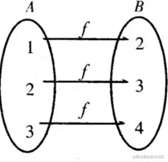

# Generating Remap Mapping Files
The aim is to develop a GStreamer filter that transform fisheye image into corrected single-angle or equirectangular images. This transformation requires reading a set of X, Y mapping tables to reposition each point, known as remap maps.

For two sets A and B, the mapping function is 



for every element *b* in *B*, *b = f(a)*, f is the mapping function

The image mapping is denoted as,
```
g(x,y) = f(h(x,y))
``` 

*remap()* function can be utilized if the platform support **OpenCV**, or else, for GStreamer it can be achieved using image filter element.

---
## Moil Image Generator
The **Moil Image Generator** website offer an online interface that we can get the X,Y map files used on GStreamer command.

The website URL: http://140.112.12.82/moilmapgen/