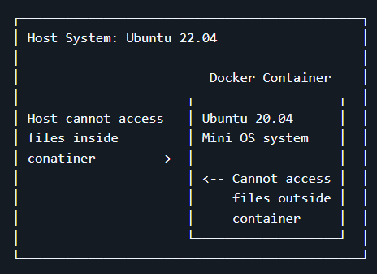
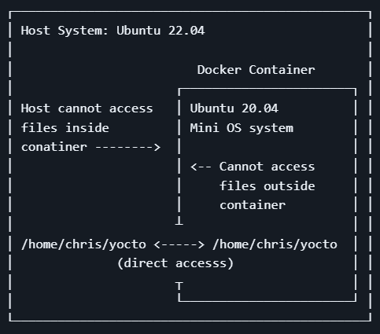

# Docker
## About
Docker is a software platform that allows you to build, test, and deploy applications quickly. Docker packages software into standardized units called containers that have everything the software needs to run including libraries, system tools, code, and runtime.
**
### Files inside Directories Inside vs Outside the Container
When operate inside the container, the entire container file system is **isolated** from the host file system. You will **not** able to access the environment located inside the container. 



To access the the files inside the the docker container, you should choose a shared directory on your host machine that can be accesible from **both** inside and outside the container.

In this case:
- Host PC environment: /home/chris/yocto
- Inside docker container: /home/chris/yocto



### User Accounts Inside vs Outside the Container
Users inside a docker container are different to the host users, they have different UID.

If you have to use `sudo docker` everytime to run docker, it is highly recommended to add the user into the docker group:
```bash
sudo usermod -a -G docker ${USER}
```

Check that you are in the docker group:
```bash
id -nG | grep docker
```

Verify that you can run docker commands without sudo:
```bash
docker run hello-world
```

## Setup
The Yocto 3.1 project must be built under Ubuntu 20.04 environment, the docker image must fulfill this requirement to be able to function properly.

### Step 1: Download the correct dockerfile
You can use the following command to download:
```bash
wget https://raw.githubusercontent.com/renesas-rz/docker_setup/master/Dockerfile.rzg_ubuntu-20.04
```

### Step 2: Build an image
Before you can use docker for BSP, a docker **image** need to be built.

Copy and paste the following code:
```bash
docker build --no-cache \
  --build-arg "host_uid=$(id -u)" \
  --build-arg "host_gid=$(id -g)" \
  --build-arg "USERNAME=$USER" \
  --build-arg "TZ_VALUE=$(cat /etc/timezone)" \
  --tag rz_ubuntu-20.04 \
  --file Dockerfile.rzg_ubuntu-20.04  .
```
- Change the `--tag` name to whatever you want.

After building, verify the image was created by using the following code:
```bash
docker images
```
```bash
REPOSITORY           TAG       IMAGE ID       CREATED          SIZE
rz_ubuntu-20.04      latest    960cf1be32b0   57 seconds ago   1.25GB
```
### Step 3: Start a Container using the Image
```bash
mkdir -p /home/$USER/yocto

docker run -it \
  --name=my_container_for_20.04 \
  --volume="/home/$USER/yocto:/home/$USER/yocto" \
  --workdir="/home/$USER" \
  rz_ubuntu-20.04
```

### Step 4: Using the container
To show the running containers:
```bash
docker ps
```

To show all your containers (running and stopped):
```bash
docker ps -a
```

To start your container:
```bash
docker start <container_name>
```

To enter back into your running container:
```bash
docker exec -it <container_name> /bin/bash
```

To exit the container:
```bash
exit
```

Below are the Docker commands that are often used:
```bash
docker info
docker images
docker ps                 ( only running container)
docker ps -a              ( all )
docker start my_container_for_20.04 
docker exec -it my_container_for_20.04 /bin/bash
docker rm <container>     # remove a container, stop it first 
docker rmi <image>        # remove a image
```

References:

- [Linux Startup Guide](http://140.112.12.82/docu-moil-renesas/assets/files/LinuxStartUpGuide-v3.0.6-a054b3a83140c44a03d92433b163ee18.pdf)

- [Renesas RZ Docker Setup](https://github.com/renesas-rz/docker_setup)
