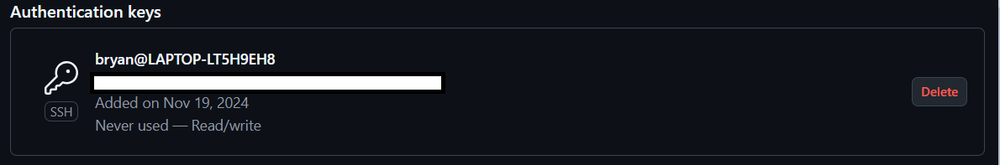
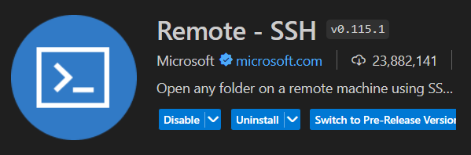
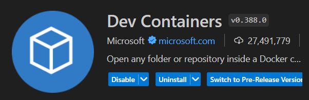

# Setting up software on Ubuntu

## OpenSSH
**Step 1**: Installing the SSH Client using the code below:
```bash
sudo apt install openssh-client
```
**Step 2**: Generating private key on another laptop or PC:
```bash
ssh-keygen -t rsa
```

**Step 3**: Storing the generated key into **Github** Account:



## Visual Studio Code
**Step 1**: Download Visual Studio Code from the [official website](https://code.visualstudio.com/).

**Step 2**: Install **Remote - SSH** extension for controlling the mini PC remotely.



## Docker
**Step 1**: Install **Dev Containers** extension, where it can creates individual container for different projects.

