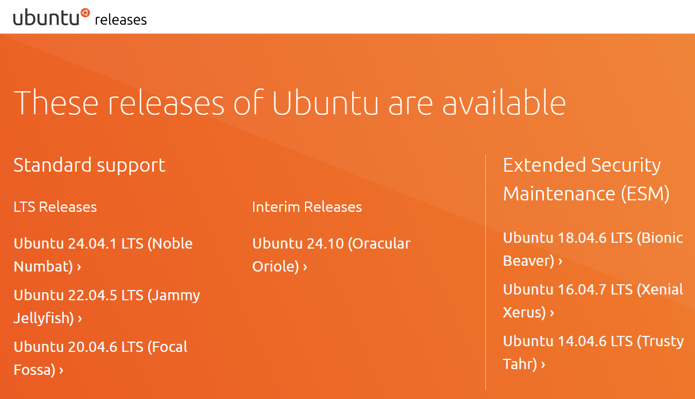
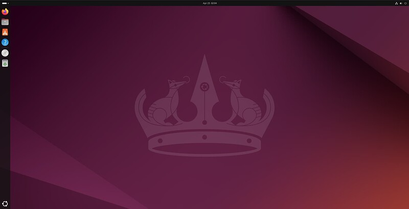

# Settings up Ubuntu OS
**Step 1**: Download the Ubuntu Operating System **v22.04** from the official website. [Ubuntu](https://mirror.twds.com.tw/ubuntu-releases/) Offical Site.

**Step 2**: Flashing the Ubuntu Operating System onto a USB Drive that have at least **32 GB** free of space. [BalenaEtcher](https://etcher.balena.io/) is a bespoke software used to flash the USB.

**Step 3**: Insert the flashed USB drive into the mini PC. Initialize the Ubuntu Operating System on the mini PC. By following the steps from the [Ubuntu Website](https://ubuntu.com/tutorials/install-ubuntu-desktop#10-complete-the-installation), you will have a freshly loaded Ubuntu Operating System that runs on the mini PC.

