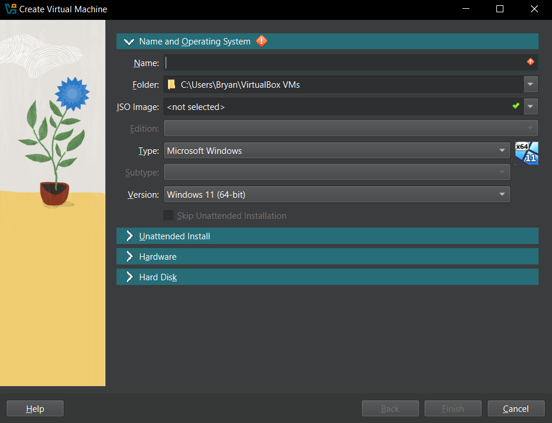
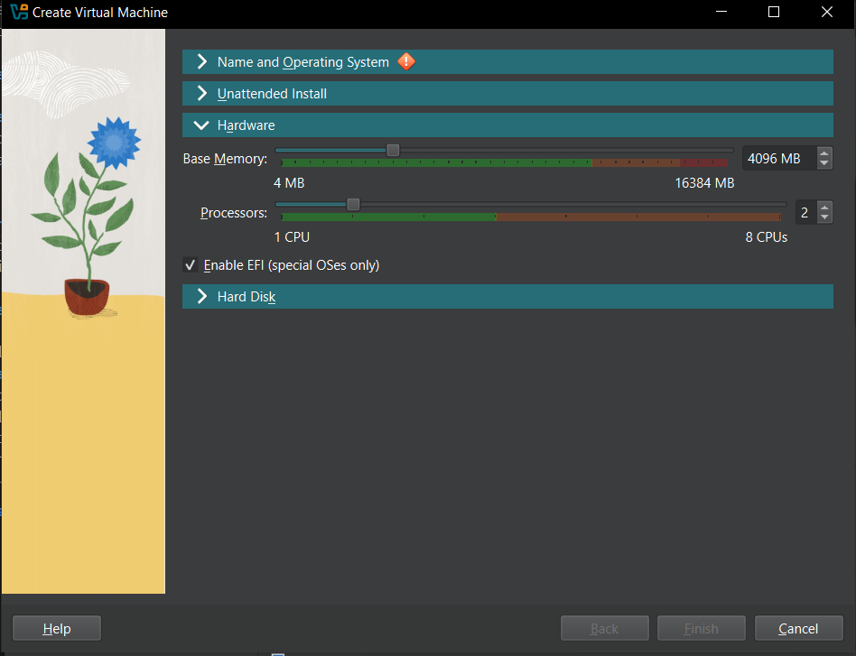
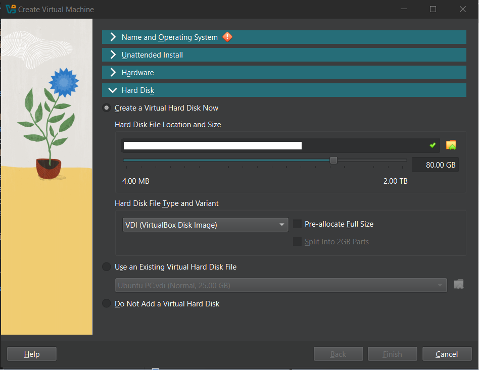

# Setting Up a Virtual Machine

## Introduction

A virtual machine (VM) is a software emulation of a physical computer. VMs allow you to run multiple operating systems on a single physical machine, providing flexibility and isolation. This tutorial will guide you through the steps to set up a virtual machine using VirtualBox, a free and open-source VM software.

## Prerequisites

- A computer with an internet connection
- Administrative privileges on your computer
- Basic understanding of operating systems

## Step 1: Download and Install VirtualBox

- Visit the [VirtualBox download page](https://www.virtualbox.org/wiki/Downloads).
- Download the appropriate installer for your operating system (Windows, macOS, Linux).
- Run the installer and follow the on-screen instructions to complete the installation.

## Step 2: Download an Operating System ISO

- Choose the operating system you want to install on your virtual machine. Popular choices include Ubuntu, Windows, and CentOS.
- Download the ISO file for your chosen operating system from its official website. For example, you can download Ubuntu from the [Ubuntu download page](https://ubuntu.com/download).

## Step 3: Create a New Virtual Machine

- Open VirtualBox.
- Click on the **New** button to create a new virtual machine.

- Enter a name for your virtual machine 
- Select the Operating System ISO file that you just downloaded.
- Select the type and version of the operating system you will install. 
- For Ubuntu, choose `Linux` as the type and `Ubuntu (64-bit)` as the version.
- Click **Next**.

## Step 4: Allocate Resources

### Memory (RAM)
- Choose the amount of memory (RAM) to allocate to your virtual machine. It is recommended to allocate at least 2 GB (2048 MB) for modern operating systems.

### Processors
- Choose the number of CPU core to allocate for your VM.
- It is recommended to start with 1 or 2 cores and increases only if needed.
- It is **not** recommeded to allocate more than 50% of your CPU cores as the host still needs CPU power to manage the VM.

## Step 5: Create a Virtual Hard Disk

- Specify the size of the virtual hard disk. A minimum of 20 GB is recommended for most operating systems.
- Choose the hard disk file type. The default option (VDI) is usually fine.
- Decide whether you want the hard disk to be **dynamically** allocated or **fixed** size. 

:::tip Types of Hard Disk

- Dynamically allocated disks grow in size as needed. 
- Fixed size disks allocate the specified amount of space immediately.

:::

Click **Finish** after all the settings are satisfied.

## Step 6: Start the Virtual Machine
In Virtual Box, select the VM that you just created and click **Start**.

## Step 7: Install the Operating System
Follow the on-screen instructions for the OS installation:

For **Ubuntu**, select **Install Ubuntu** and follow the instruction.

## Congratz! 🎉
You now have a fully functional virtual machine running in Virtual Box.

